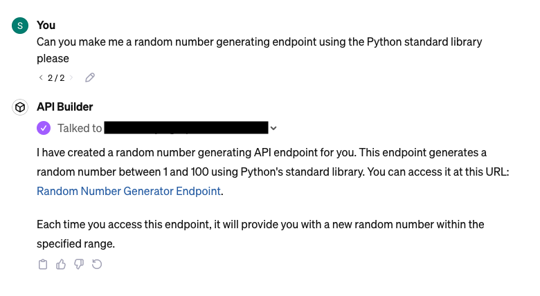

# Self Modifying API

WARNING: PLEASE DO NOT USE THIS IN REAL LIFE - PROOF OF CONCEPT ONLY

## What is this

This is an attempt to make an API that can accept POST requests that result in
changes to its own codebase and therefore its own API surface.

In its current state, this is VERY DANGEROUS to deploy anywhere to the internet.

The core of this API is a single POST request handler which:

1. Accepts some Python code as a string
   1. We expect to be in a particular format - see `healthcheck.py` for reference
2. Commits the code to a file in its own GitHub repo
3. Updates `app.py` to expose the new route in the API
4. Triggers a new deployment (we used Render because we're familiar with it)

## WHY??

We had a half-baked idea that this might work well with GPTs/OpenAI's Assistants API
to allow a GPT to bootstrap its own actions.

It turns out that GPTs do not dynamically import API documentation from a provided URL,
so this doesn't really work without having to reload the actions every time a
new endpoint is created.

For details on GPT configuration, see below.

## Usage and installation

This is FastAPI project, so install dependencies from `requirements.txt` and
run `./bin/dev` to start the development server locally.

## Using this API with a GPT

We tested using this API as a backend for GPT actions. The configuration we used is below.

Name: `API Builder`

Description: `Make API endpoints on the fly`

Instructions:

    You make API endpoints by writing Python code for a FastAPI backend. An example of the code you might write is:

    ```python
    from fastapi import APIRouter
    router = APIRouter()
    @router.get("/test")
    def test():
        return {"status": "test"}
    ```

    for which, you would use the filepath "test.py", for example.

    Make sure to always use

    ```python
    from fastapi import APIRouter
    router = APIRouter()
    ```

    when you make new endpoints.

Actions were imported from the `/openai.json` endpoint exposed by the FastAPI server, but we
had to manually add our server URL to the document to make the actions work.

### Example:


Request sent to backend:

```json
{
  "code": "from fastapi import APIRouter\nimport random\n\nrouter = APIRouter()\n\n@router.get(\"/random-number\")\ndef generate_random_number():\n    return {\"random_number\": random.randint(1, 100)}",
  "filepath": "random_number.py"
}
```

## Known limitations

New dependencies are not currently handled (e.g. if some Python code for a new endpoint
uses numpy, we don't try to install missing dependencies).
