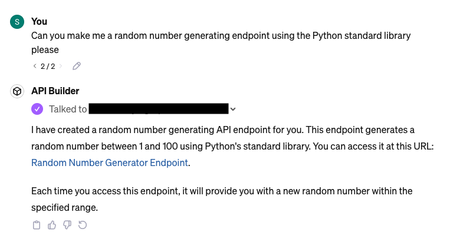

# Kendini Değiştiren API

UYARI: LÜTFEN BUNU GERÇEK HAYATTA KULLANMAYIN - SADECE KONSEPT KANITLAMASI

## Bu Nedir

Bu proje, kendi kod tabanını ve dolayısıyla kendi API yüzeyini değiştirebilen POST isteklerini kabul edebilen bir API oluşturma girişimidir.

Mevcut durumda, bu API'yi internete açık bir şekilde dağıtmak ÇOK TEHLİKELİDİR.

Bu API'nin özünde, tek bir POST istek işleyicisi bulunur ve şunları yapar:

1. Python kodunu bir string olarak kabul eder
   1. Belirli bir formatta olması beklenir - referans için `healthcheck.py` dosyasına bakın
2. Kodu kendi GitHub deposuna commit eder
3. Yeni rotayı API'de göstermek için `app.py` dosyasını günceller
4. Yeni bir dağıtım tetikler (Render'ı kullandık çünkü bu platformla tanışığız)

## NEDEN??

GPT'ler/OpenAI'nin Asistanları API'si ile iyi çalışabileceğini ve bir GPT'nin kendi eylemlerini özyüklemesine izin verebileceğini düşündük.

Ancak GPT'lerin verilen bir URL'den API belgelerini dinamik olarak içe aktarmadığı ortaya çıktı, bu nedenle her yeni uç nokta oluşturulduğunda eylemleri yeniden yüklemek zorunda kalmadan bu gerçekten işe yaramıyor.

GPT yapılandırması hakkında detaylar için aşağıya bakın.

## Kullanım ve Kurulum

Bu bir FastAPI projesidir, bu nedenle `requirements.txt` dosyasından bağımlılıkları yükleyin ve
yerel geliştirme sunucusunu başlatmak için `./bin/dev` komutunu çalıştırın.

## Bu API'yi GPT ile Kullanma

Bu API'yi GPT eylemleri için bir arka uç olarak test ettik. Kullandığımız yapılandırma aşağıdadır.

İsim: `API Builder`

Açıklama: `Anında API uç noktaları oluştur`

Talimatlar:

    FastAPI arka ucu için Python kodu yazarak API uç noktaları oluşturursunuz. Yazabileceğiniz kod örneği:

    ```python
    from fastapi import APIRouter
    router = APIRouter()
    @router.get("/test")
    def test():
        return {"status": "test"}
    ```

    Bu durumda, örneğin "test.py" dosya yolunu kullanırsınız.

    Yeni uç noktalar oluştururken her zaman şunu kullanmayı unutmayın:

    ```python
    from fastapi import APIRouter
    router = APIRouter()
    ```

Eylemler, FastAPI sunucusu tarafından sunulan `/openai.json` uç noktasından içe aktarıldı, ancak
eylemlerin çalışması için sunucu URL'mizi manuel olarak belgeye eklememiz gerekti.

### Örnek:


Arka uca gönderilen istek:

```json
{
  "code": "from fastapi import APIRouter\nimport random\n\nrouter = APIRouter()\n\n@router.get(\"/random-number\")\ndef generate_random_number():\n    return {\"random_number\": random.randint(1, 100)}",
  "filepath": "random_number.py"
}
```

## Bilinen Sınırlamalar

Yeni bağımlılıklar şu anda işlenmiyor (örneğin, yeni bir uç nokta için Python kodu numpy kullanıyorsa, eksik bağımlılıkları yüklemeye çalışmıyoruz).